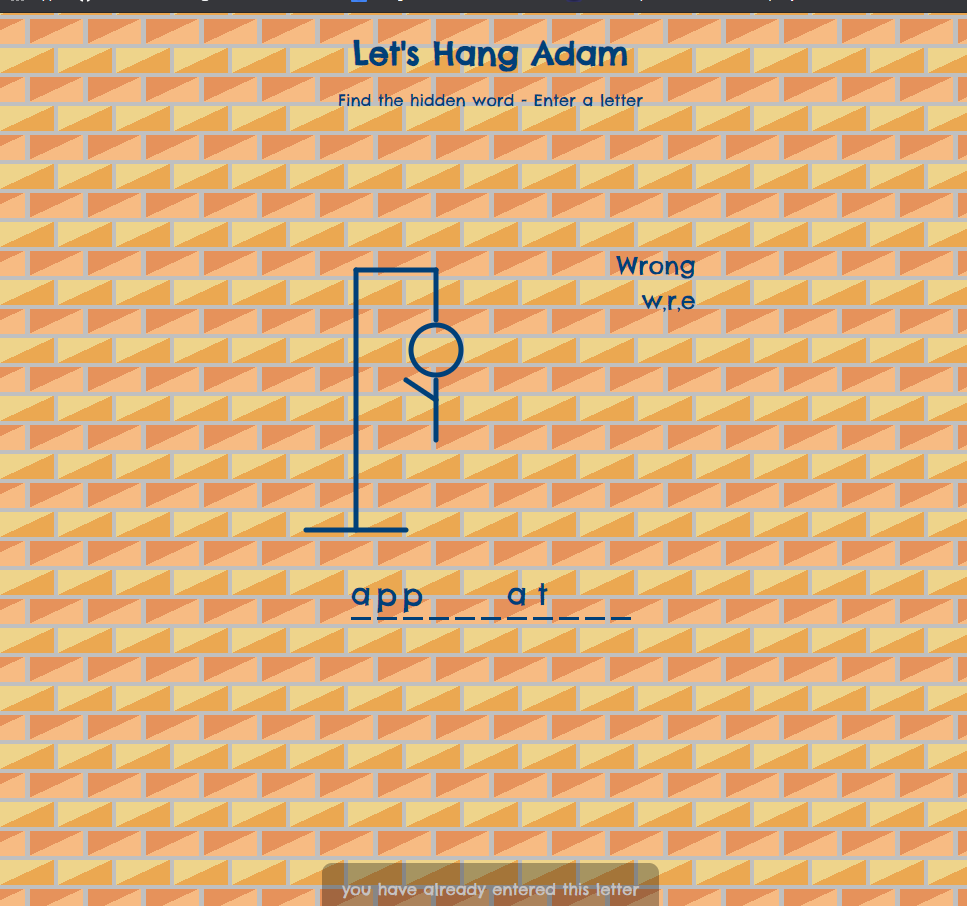

## Let's hang ADAM 
#
### Guessing game - originally known as hangman - only for laptops 
#
### Tech Stack
- Vanilla Javascript
- HTML
- CSS 
#
## Features
- Every game has a new word by random
- Player should find the word by guessing the letters one by one 
- Each time the player guess wrongly a body part will be appear on the poll
- If Adam completed on the poll it means that the player has lost. After loosing or winning player can try again.
#
### View

#

 ## <a name="play">Let's hang Adam!</a> 💀 [play here](https://lets-hang-adam.netlify.app/) 💀
 #
## Thank you for watching---->> [👩🏻‍💻Barri🎨](http://bdesginstudio.co.uk) &  [more projects](https://github.com/BarriF13) 

